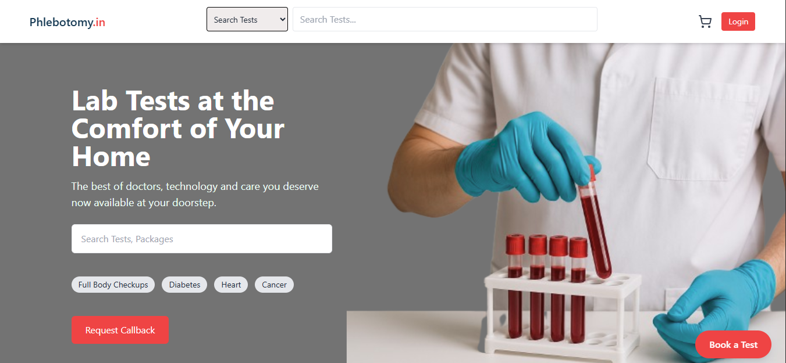
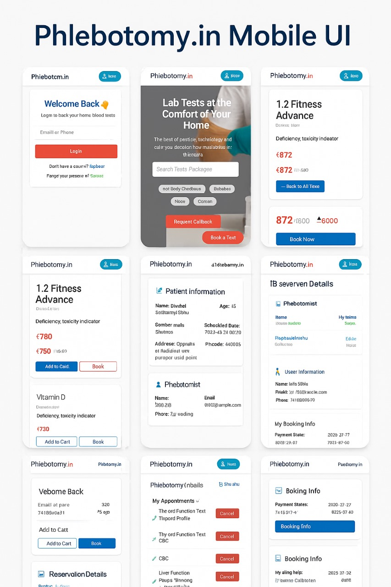

# 🧪 Phlebotomy.in – Feature Overview & UI Showcase

Welcome to the official documentation and design showcase of the **Phlebotomy Diagnostic Platform** – a modern solution for home sample collection and test booking.

## 📎 Live Preview

🔗 [Phlebotomy.in deployed app](https://phlebotomy-user-panel.onrender.com/)

---

## 📸 UI Previews

### 💻 Desktop View

### 📱 Mobile View

---

# 🧩 Feature Documentation by Role

---

## 🛡️ Admin Features

Admins have full control over users, reservations, tests, packages, lab partners, reports, and system-wide analytics.

### 👥 User Management
- Add new users
- Modify user roles (approve/ban/admin)
- View all users
- Get admin status of a user
- Access user profiles & reservation history

### 🔬 Test & Package Management
- Create, update, delete tests
- Bulk upload tests via Excel
- Create diagnostic packages linked to multiple tests

### 📦 Package Management
- Create packages that group multiple testIds

### 🧪 Reservation Management
- View all reservations
- Edit reservation details (status, date, etc.)
- Transfer reservations between phlebotomists
- Manually assign reservations to phlebotomists

### 📈 Dashboard & Analytics
- View admin dashboard stats (daily, total counts)
- Top booked tests
- Booking trends
- Export CSV of users & reservations

### 🧑‍🔬 Phlebotomist Management
- View all registered phlebotomists
- Create new phlebos manually
- Update phlebo availability/status

### 🏥 Lab Partner & Location Management
- Add lab partners
- Assign pincodes to labs for auto-routing
- Update lab partner status
- Manage states, districts, cities, and pincodes
- Toggle service availability by pincode

### 🖼️ Banner Control
- Create & delete promotional banners
- Activate/deactivate banners

### 📄 Report Handling
- Upload test report links per reservation

---

## 👤 User Features

Users are patients or customers using the app to browse, book, and manage diagnostic services.

### 👨‍⚕️ Profile & Auth
- Register and login via secure JWT
- Update profile details
- Reset password via OTP
- View bookings and personal history

### 🔬 Test & Package Exploration
- Browse all available diagnostic tests
- View test details by ID
- Browse curated diagnostic packages
- View doctors (if integrated for recommendations)

### 📅 Reservation Flow
- Book test or package (with date/time/address)
- Book as guest (without login)
- Cancel upcoming reservations
- View/download test reports
- Book available time slots

### 💳 Cart
- Add tests/packages to cart
- Edit or remove cart items
- Clear entire cart

### 💬 Feedback
- Submit service feedback for quality assurance

---

## 🧑‍🔬 Phlebotomist Features

Phlebos are technicians assigned to visit homes for sample collection.

### 🔐 Profile & Availability
- Login securely with credentials
- Apply for phlebo role via public form
- Toggle availability (available/away)
- Reset password via OTP

### 📅 Work Management
- View all assigned reservations
- See upcoming appointments (based on date)
- Mark sample as "collected"
  - Upload barcode
  - Attach geo-location
  - Upload proof photo

---

## 🔄 Common System Features

### 📍 Lab Partner Routing
- Auto-routes reservation to lab partner based on pincode

### ⏱️ Slot Booking System
- Users select available phlebo slots
- Slot assignment linked to reservations

### 🧾 Report Management
- Admin uploads report URL
- Users can download/view reports from profile

---

## 🙌 Contributing & License

This project is actively maintained and welcomes collaboration. Please open issues or submit PRs if you'd like to contribute.

---

## 📬 Need a Custom Web Platform or Diagnostic Lab Solution?

If you're looking for a tailor-made diagnostic web platform, patient booking system, or other custom solutions — feel free to reach out!

📧 Email: [ishusahu593@gmail.com](mailto:ishusahu593@gmail.com)  
🔗 LinkedIn: [https://www.linkedin.com/in/ishu-sahu-1981b4182/](https://www.linkedin.com/in/ishu-sahu-1981b4182/)

> 🚀 Existing code for this repository is private.  
> If you’d like access or want to collaborate, don’t hesitate to contact me.

